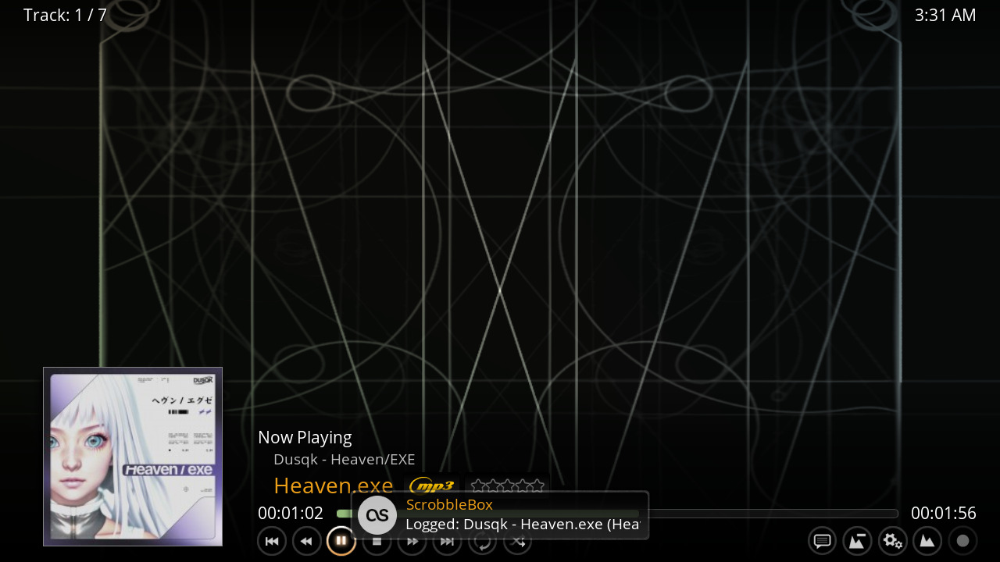
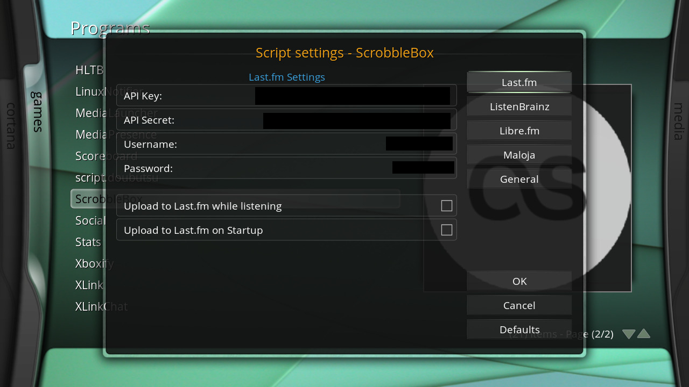
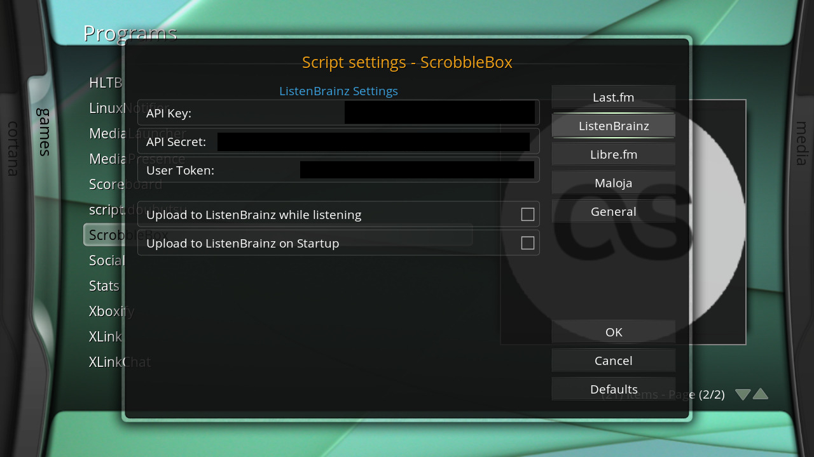
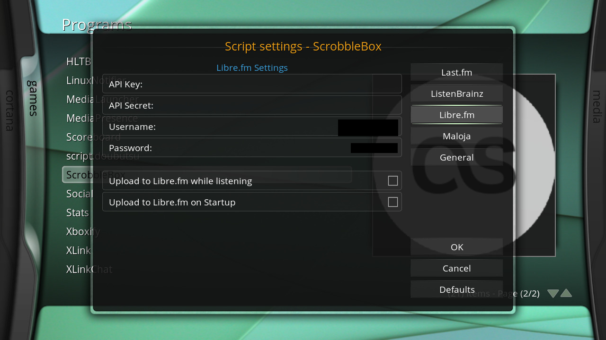
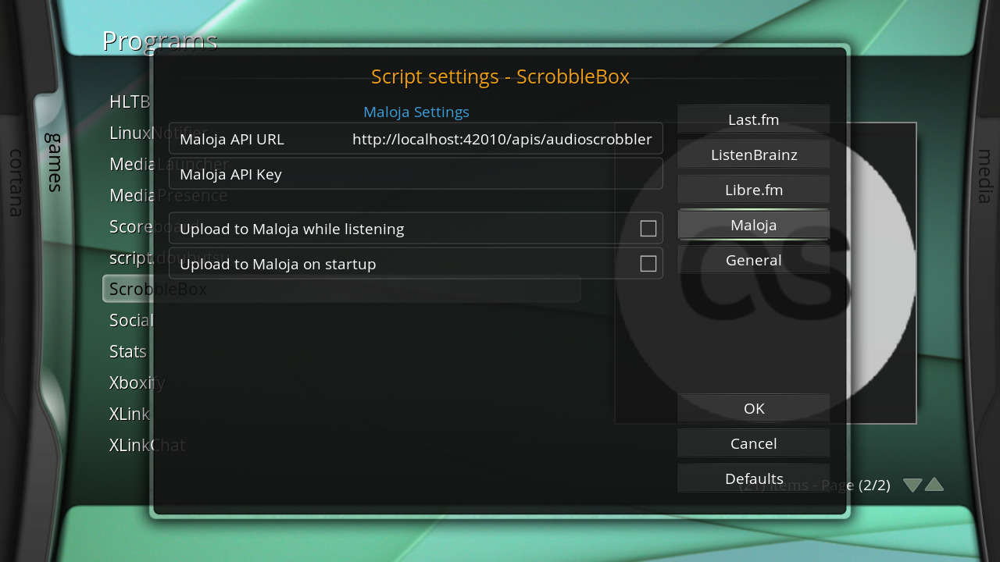
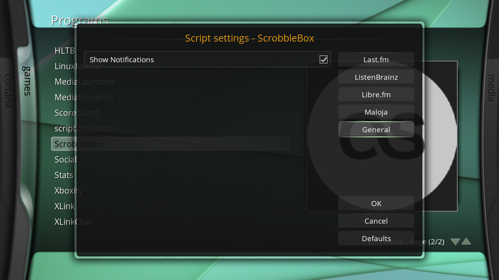

# ScrobbleBox - an Rockbox-style scrobble logger for XBMC4Xbox (now with online scrobbling support!)
A simple XBMC4Xbox addon that logs scrobbled songs onto Last.fm/Libre.fm/ListenBrainz/Maloja, or to a "scrobbler.log" file, like Rockbox does.

## How to use:
- Install ScrobbleBox to your scripts folder in XBMC4Xbox
- Run ScrobbleBox, select "Start ScrobbleBox", listen to music and enjoy as ScrobbleBox scrobbles in the background! (All tracks are automatically scrobbled after reaching at least the halfway point!)
- To upload scrobbles, grab your scrobbles from "scrobbler.log" from your Q directory and use a program such as rb-scrobbler to upload it! (uploading directly to last.fm/libre.fm is TBA)

## Bugs:
- Seeking through tracks can make duplicate log entries appear.
- Scrobble posting support is still very new, errors may occur!

## Why?
Because I do a lot of my music listening on my original Xbox, as it's the main thing connected to my media center with a CD/DVD drive, so I like being able to scrobble my tracks as I listen to them. As I have an iPod that I log scrobbles onto offline, I figured I wanted to make a similar offline solution for the original Xbox, to futureproof scrobbling on XBMC4Xbox against further SSL/TLS degradation. 
